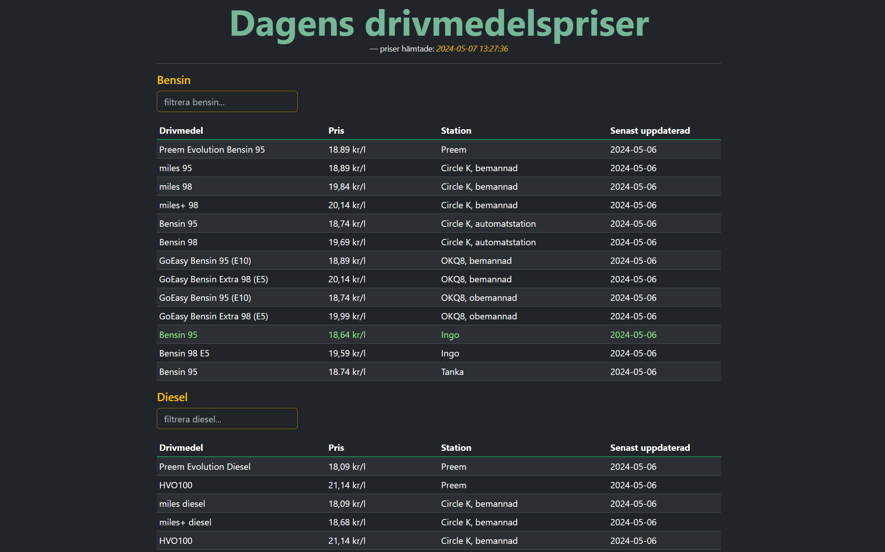

# Fuel Price Tracker

### ⚠️ **2025 UPDATE: Due to decisions from the Swedish government, the majority of gas stations have chosen to remove current fuel prices from their websites in January 2025. Sadly, that means this project is no longer relevant, as the required data is simply not available.** ⚠️ 

### Old project description and links

> This website can be used to easily find the current fuel prices for both gasoline and diesel in Sweden. The application collects prices from Swedish gas stations, compares them, and highlights the cheapest ones.

> #### Data is currently fetched from:
> - [Preem](https://www.preem.se/privat/drivmedel/drivmedelspriser/)
> - [Circle K](https://www.circlek.se/drivmedel/drivmedelspriser)
> - [OKQ8](https://www.okq8.se/pa-stationen/drivmedel/)
> - [Ingo](https://www.ingo.se/v%C3%A5ra-l%C3%A5ga-priser/v%C3%A5ra-l%C3%A5ga-priser/aktuella-listpriser)
> - [Tanka](https://tanka.se/)

## ~~Live version link~~
~~Hosted on [Koyeb](https://inadequate-selie-juninger-dev.koyeb.app/)~~

⚠️ No longer available. 

## Preview 

## Frameworks & Libraries

This project is using:
- [Apache Maven](https://maven.apache.org/)
- [Jsoup](https://jsoup.org/)
- [Spring Boot](https://spring.io/projects/spring-boot)
- [Jackson](https://github.com/FasterXML/jackson)
- [Thymeleaf](https://www.thymeleaf.org/index.html)
- [Bootstrap](https://getbootstrap.com/) 